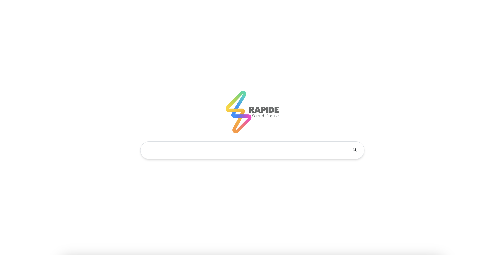

# group-01

<div align= >

#  Rapide

</div>
<p align="center">
   
</p>

<p align="center"> 
    <br> 
</p>

##  Table of Contents

- <a href ="#about"> 📙 Overview</a>
- <a href ="#Started"> 💻 Get Started</a>
- <a href ="#Work"> 🧱 Search Engine Modules </a>
- <a href ="#Video"> 📽 Demo</a>
<hr style="background-color: #4b4c60"></hr>

<a id = "about"></a>

##  Overview

<ul>
<li> The aim of this project is to develop a simple Crawler- based search engine that demonstrates the main features of a search engine
and the interaction between them.</li>
<li> The main features of a search engine</li>
<ul>
<li> Web Crawling</li>
<li> Indexing</li> 
<li> Ranking</li>
</ul>
<br>
<li> Built using <a href="https://en.wikipedia.org/wiki/Java_(programming_language)">Java lnaguage</a>.</li>
<li>  Web interface  for  Search Engine  using <a href="https://en.wikipedia.org/wiki/HTML">Html</a> & <a href="https://en.wikipedia.org/wiki/CSS">CSS</a> & <a href="https://en.wikipedia.org/wiki/JavaScript">JS</a>.</li>

<li> Built using <a href="https://en.wikipedia.org/wiki/PostgreSQL">Postgresql</a>.</li>
</ul>
<hr style="background-color: #4b4c60"></hr>
<a id = "Started"></a>

##  Get Started

<ol>
<li>Clone the repository.

<br>

```
git clone https://git.cs.uni-kl.de/dbis/is-project-22/group-01.git
```

</li>
<li> You will need to download and install <a href="https://www.oracle.com/java/technologies/downloads/">Jdk</a>. </li>

<li> You will need to download <a href="https://tomcat.apache.org/download-10.cgi">Tomcat</a>. </li>

<li> You will need to download and install <a href="https://www.pgadmin.org/download/">pgAdmin</a>. 
  <ul>
    <li>Note the default port you choosed</li>
  </ul>
</li>

<li>Open the cloned folder with IntelliJ</li>

<li>Use Gradle to install all the dependencies</li>

<li>
  Create a database in pgAdmin
  <ul>
    <li>Note the name and the password you defined</li>
  </ul>
</li>

<li>Go to IntelliJ and edit the file
<br>

```
/src/main/java/DB/DBVars.java
```
</li>

<li>
Do the migration. It will Create all the tables.
<br>Go to

```
/src/main/java/DB/Migrator.java
```
and run it.
</li>

<li>To run the Crawler, goto the following file and run it

```
/src/main/java/Crawling.java
```
</li>
</ol>

<br>
<hr style="background-color: #4b4c60"></hr>

## How to run the CLI
Run:

```
/src/main/java/CLI.java
```
<br>

<br>
<hr style="background-color: #4b4c60"></hr>

## How to run the Tomcat Server
Use the following <a href="https://www.jetbrains.com/help/idea/run-debug-configuration-tomcat-server.html">instructions</a> for it.

<br>
<hr style="background-color: #4b4c60"></hr>
<a id = "Work"></a>

##  Search Engine Modules

<table align="left;">
<tr>
<th width=23%>Module</th>
<th>Description</th>
</tr>
<tr>
<td> 🔷 Web Crawler</td>
<td>A web crawler is a software agent that collects web documents. The crawler begins with a list of URLs (seed set). It retrieves the documents identified by these URLs and extracts hypertext links from them. The URLs that have been extracted are added to the list of URLs to be downloaded. Web crawling is thus a recursive process.</td>
</tr>
<tr>
<td>🔶 Indexer</td>
<td>The output of web crawling process is a set of downloaded HTML documents. To respond to user queries fast enough, the contents of these documents have to be indexed in a data structure that stores the words contained in each document and their importance.</td>
</tr>
<tr>
<td> 🔷 Query Processor</td>
<td>This module receives search queries, performs necessary preprocessing and searches the index for relevant documents. Retrieve documents containing words that share the same stem with those in the search query. For example, the search query “travel” should match (with lower degree) the words “traveler”, “traveling” … etc.</td>
</tr>
<tr>
<td>🔶 Phrase Searching</td>
<td>Search engines will generally search for words as phrases when quotation marks are placed around the phrase.</td>
</tr>
<tr>
<td>🔷 Ranker</td>
<td>
<p>The ranker module sorts documents based on their popularity and relevance to the search query.
</p>
<ol>
<li>Relevance</li>
<p>Relevance is a relation between the query words and the result page and could be calculated in several ways such as tf-idf of the query word in the result page or simply whether the query word appeared in the title, heading, or body. And then you aggregate the scores from all query words to produce the final page relevance score.</p>
<li>Popularity</li>
<p>Popularity is a measure for the importance of any web page regardless the requested query. You can use pagerank algorithm (as explained in the lecture) or other ranking algorithms to calculate each page popularity.</p>
</ol>
</td>
</tr>
<td>🔷 Web Interface</td>
<td><p>We  implement a web interface for  search engine.</p> 
<ul>
<li>This interface receives user queries and displays the resulting pages returned by the engine</li>
<br>
<li>The result appears with snippets of the text containing queries words. The output looks like google's results page.</li>
</ul>
</td>
</tr>
</table>

<hr style="background-color: #4b4c60"></hr>
<a id ="Video"></a>

##  Demo

<div  align="center">
  
</div>